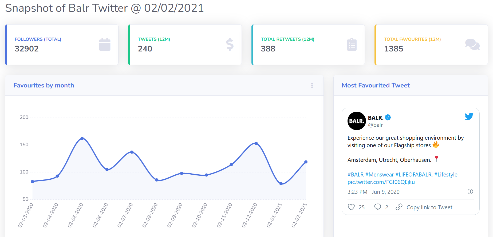

# Current state
This was my first front end project, after finishing it i realised the limitations of HTML and vanilla JS. Currently working on rewriting in React. Would not recommend using this project as a boiler plate for a project, learn from my mistakes. 

# Personal Project Portfolio

This project is a dashboard I built, with data from Twitter using #BALR. https://www.balr.com/  

## Screenshot



## Project Example

https://balr-twitter.bradwebb101.com/

## Things i borrowed

- HTML dashboard template https://startbootstrap.com/theme/sb-admin-2. SB Admin 2 is a Bootstrap 4 admin theme template.

## How is it built

### Front end

- This project is built on HTML and Vanilla Javascript. Templating is done with Handlebars.

### Back end

- This site is built as a serverless application, it uses AWS Lambda, S3, DynamoDB, API Gateway and Cloudfront.
- The back end is written in Python, using Tweepy to get data from the Twitter API.
  
## Infrastructure


## Downloading and usage

### Front-end
As the front end is just HTML and Vanilla JS, the only dependency on the front end is a web browser. The data for the dashbaord is on my AWS account. To test locally, i have included a example object with data which i have commented out. Open the file js/load-functions.js and follow the instructions in that file to use sample data on the dashobard.

### Back-end

Clone this repo 

``` git
git clone https://github.com/BradWebb101/balr_twitter.git .
```

Install dependancies

``` pip
pip install -r requirments.txt
```

- You will need to set up Twitter API credentials with Twitter.
- You will need to set up an AWS account, and set up a table in DynamoDB called 'balr_twitter'
- Environment variables needed in .env file
  - API_KEY: Twitter api key
  - API_KEY_SECRET: Twitter api secret key
  - BEARER_TOKEN: Twitter api bearer token
  - ACCESS_TOKEN: Twitter api access token
  - ACCESS_TOKEN_SECRET: Twitter api secret token
  - AWS_ACCESS_KEY_ID: AWS access key
  - AWS_SECRET_ACCESS_KEY: AWS secret key
  - AWS_DEFAULT_REGION: Aws default region

All environment variable are the same as the ones in the AWS and Twitter API documentation.

Run back end code

``` python
python main.py
```

## Example code 

This project uses Python lists and dictionaries to iterate over the JSON and reconstruct serialised objects for Dynamo DB.

``` python 
def language_of_tweet(self):
        language_list = []
        for tweet in self.twitter_data.hashtags:
            language_list.append(tweet['lang'])
   
        language_counts = {}
        for n in list(set(language_list)):
            language_counts[n] = language_list.count(n)
        
        language_counts = dict(sorted(language_counts.items(), key=lambda item: item[1], reverse=True))

        count = 0
        others = 0
        lang_labels = []
        lang_data = []
        for k,v in language_counts.items():
            if count < 5:
                if k != 'und':
                    lang_labels.append({'S':str(k)})
                    lang_data.append({'N':str(v)})
                    count += 1
                else:
                    count += 1
                    others += v
            else:
                 others += v
        lang_labels.append({'S':'Other'})
        lang_data.append({'N':str(others)})
        
        self.dict['lang_labels'] = {'L':lang_labels}
        self.dict['lang_data'] = {'L':lang_data}
```
